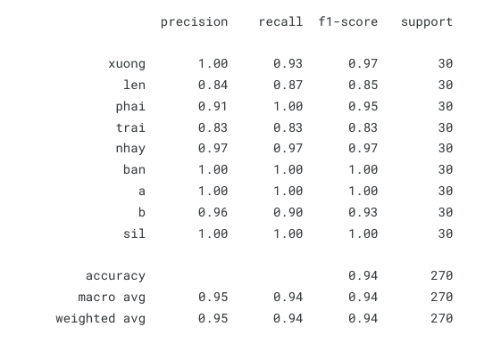
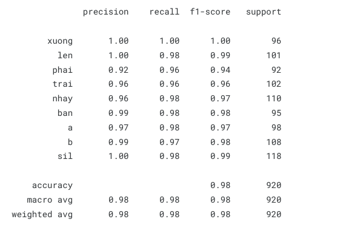

# Bài tập môn xử lý tiếng nói
 1. Trích xuất đặc trưng MFCC (39 đặc trưng, gồm cả MFCC, delta, deltadelta) của từng khẩu lệnh / con số trong cả 2 file hmm_model_train.ipynb và speechprocessing.inynb
 2. Viết chương trình sử dụng DTW để nhận dạng khẩu lệnh đơn lẻ (mỗi từ/khẩu lệnh dùng khoảng 2-3 mẫu)
    1. Model sử dụng DTW trích xuất template trong file speechprocessing.inynb
    2. Kết quả test với một vài mẫu thu được kết quả khá tốt
       
       
 3. Viết chương trình sử dụng HMM (segmental K-means) để nhận dạng khẩu lệnh đơn lẻ (sử dụng HMM với Mixture of Gaussians, sử dụng toàn bộ bộ dữ liệu đã thu)
    1. Kết quả của model train
       
          
    2. Demo về chương trình https://youtu.be/tbaqazYiDkM

Full code & data : https://www.kaggle.com/code/datntrong/speechprocessing

